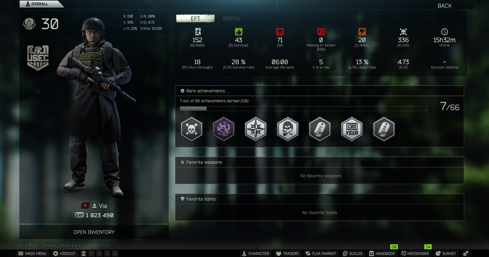
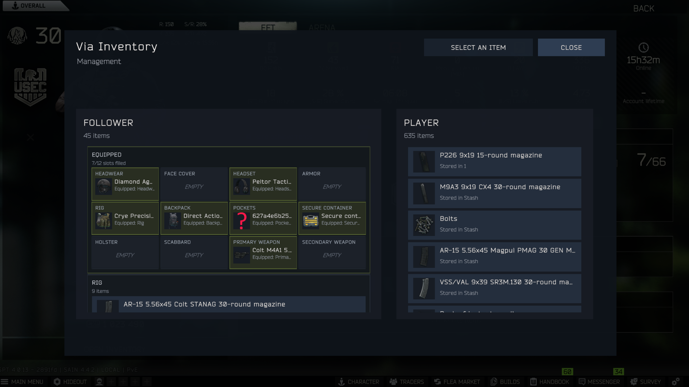
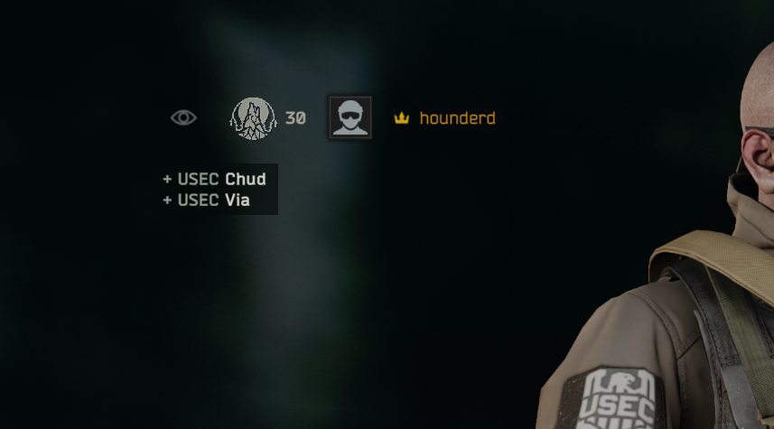
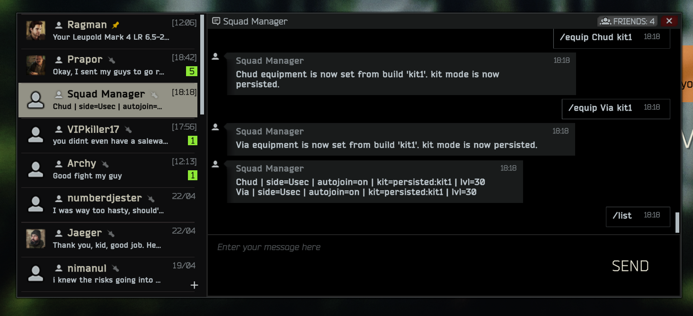

# Friendly PMCs Reborn

Friendly PMCs Reborn is an SPT 4.x mod that adds persistent PMC squadmates to single-player Tarkov.

The mod lets you keep a roster of friendly PMCs, bring selected squadmates into raids, use Tarkov's voice/gesture command system for basic follower orders, recruit compatible allies, and manage follower gear through Tarkov's existing social/profile screens.

This is the public SPT 4.x rebuild of FriendlyPMC. It is not a drop-in continuation of the old codebase; the client and server pieces have been rebuilt around SPT 4.x, BigBrain movement layers, Messenger roster commands, voice/gesture-driven follower orders, and persistent follower data.

## Screenshots

### Follower Profile

Follower profiles are exposed through Tarkov's social/profile UI and include the `OPEN INVENTORY` entry point.



### Follower Inventory

Follower inventory management shows equipped gear, carried containers, and movement targets for transferring or equipping items.



### Squad List

Managed followers appear in-game instead of being hidden as backend-only data.



### Squad Manager

The Squad Manager Messenger bot handles roster commands, autojoin settings, kit mode, saved equipment builds, and follower status.



## Requirements

Install these before using the mod:

- SPT 4.x
- BigBrain
- Waypoints
- SAIN
- Looting Bots

Friendly PMCs Reborn is developed and tested around that AI stack. BigBrain is directly referenced by the client plugin. Waypoints, SAIN, and Looting Bots are part of the supported gameplay setup because follower movement, targeting protection, and looting compatibility depend on them behaving predictably together.

If you run a different AI stack, the mod may still load, but follower behavior is not the supported path.

## Install

Download the latest release ZIP from the GitHub releases page or the SPT Forge page.

Extract the ZIP into your main SPT folder, the folder that contains `EscapeFromTarkov.exe`, `BepInEx`, and `SPT`.

After extraction, the files should be in these locations:

```text
BepInEx/
  plugins/
    FriendlyPMC.CoreFollowers/
      FriendlyPMC.CoreFollowers.dll
      FriendlyPMC.CoreFollowers.deps.json

SPT/
  user/
    mods/
      FriendlyPMC.Server/
        FriendlyPMC.Server.dll
        FriendlyPMC.Server.deps.json
        FriendlyPMC.Server.staticwebassets.endpoints.json
```

Do not install the server mod into a top-level `user/mods` folder. For SPT 4.x, the server files belong under `SPT/user/mods`.

Do not place the client DLL in a loose `netstandard2.1` folder. Keep the client plugin files together under `BepInEx/plugins/FriendlyPMC.CoreFollowers`.

## Basic Use

Open Messenger after installing the mod. The Squad Manager bot is the main roster interface.

Useful commands:

- `/help` shows the available commands.
- `/list` shows your current roster.
- `/add <nickname>` creates a follower record.
- `/autojoin <nickname> on|off` controls whether a follower joins raids automatically.
- `/kit <nickname> persisted|generated` switches between stored gear and generated kits.
- `/equiplist` lists saved player equipment builds.
- `/equip <nickname> <buildname>` applies a saved equipment build to a follower.
- `/gear <nickname>` prints a text summary of stored follower gear.
- `/info <nickname>` shows follower state.
- `/delete <nickname>` removes a follower from the roster.

In raid, follower movement and utility orders are driven by Tarkov phrase triggers, not the old direct follower hotkeys.

Current mapped phrase triggers:

- Follow: `FollowMe`
- Hold: `HoldPosition`, `Stop`
- Take cover: `GetInCover`, `CoverMe`, `NeedCover`, `TakeCover`
- Regroup: `Regroup`, `NeedHelp`
- Loot: `GoLoot`, `LootGeneric`, `LootWeapon`, `LootMoney`, `LootKey`, `LootBody`, `LootContainer`, `LootNothing`, `OnLoot`, `CheckHim`
- Attention/reset: `Look`

The only normal keyboard command currently exposed by the plugin is the configurable Heal hotkey, defaulting to `F10`.

Follower inventory management is opened from the follower profile screen through the `OPEN INVENTORY` action.

## Current Features

- Persistent server-side follower roster.
- Autojoin followers for raids.
- Same-side in-raid recruitment into the roster flow.
- Messenger-based squad management.
- Follower profile integration through Tarkov social UI.
- Follower inventory view and gear movement.
- Phrase-triggered follower orders for follow, hold, take cover, regroup, loot, and attention/reset.
- Configurable heal command hotkey, defaulting to `F10`.
- Follower plate overlays for identifying squadmates in raid.
- Compatibility handling for common AI-stack conflicts.

## Current Limitations

This is an active rebuild, not a finished squad AI overhaul.

Known rough edges:

- Large AI mod stacks can still interfere with follower behavior.
- Followers may occasionally stop responding if another behavior layer takes control.
- Inventory drag/drop and profile refresh behavior are still being polished.
- Loot phrase commands require Looting Bots to be loaded.
- The supported setup assumes BigBrain, Waypoints, SAIN, and Looting Bots are installed.

When reporting behavior issues, include your SPT version, installed AI mods, whether the follower was fighting/looting/healing/stuck, and any relevant BepInEx or SPT server logs.

## Repository Layout

```text
client-spt4/FriendlyPMC.CoreFollowers
  BepInEx client plugin source.

server-spt4/FriendlyPMC.Server
  SPT server mod source.

client-spt4/FriendlyPMC.Version.props
  Shared version metadata.

ModDescription.html
  SPT Forge description source.
```

## Building From Source

Build requirements:

- .NET 9 SDK
- Local SPT 4.x install
- BigBrain installed in the target SPT client environment

The client project expects local EFT/SPT reference paths through `client-spt4/Directory.Build.props`.

1. Copy `client-spt4/Directory.Build.props.example` to `client-spt4/Directory.Build.props`.
2. Edit the paths for your local SPT install.
3. Build the client and server projects.

```powershell
dotnet build .\client-spt4\FriendlyPMC.CoreFollowers\FriendlyPMC.CoreFollowers.csproj -c Release
dotnet build .\server-spt4\FriendlyPMC.Server\FriendlyPMC.Server.csproj -c Release
```

Client output:

```text
client-spt4/FriendlyPMC.CoreFollowers/bin/Release/netstandard2.1
```

Server output:

```text
server-spt4/FriendlyPMC.Server/bin/Release/FriendlyPMC.Server
```

## License

See `LICENSE`.
